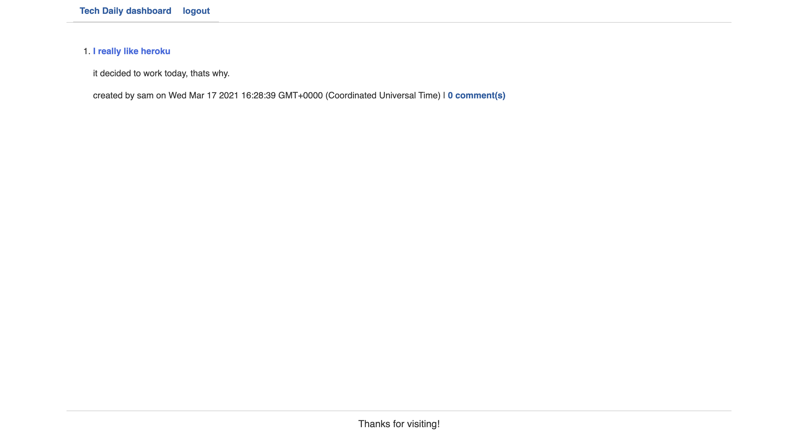

# TECH DAILY :

   
## discription 
  tech daily is a blog posting site that allows users to make posts have other users comment on those posts. the project also allows users to create profiles and login and out. the users can also edit and delete posts as they see fit.

 
## Table of contents 

* [Installation](#installation)
* [Usage](#usage)
* [Credits](#credits)
* [License](#license)
* [Badges](#badges)
* [Features](#features)
* [Contributing](#contributing)
* [Tests](#tests)
* [questions?](#questions?)

## installations 
clone repo, install dependencies, run "npm start" on commandline
## usage
  create,edit,delete,login,logout.

## credits 
none

## license
 ISC

## features
 create,edit, and  delete posts. users can also sign up then login and logout.

## contributing 
samuel saldivar

## tests
 add your own 
 
## Questions
email:samuelsaldivar11@gmail.com
github:https://github.com/samuel408
